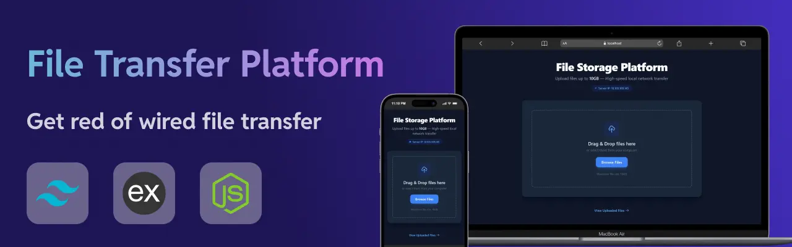

<div align="center">

# 📁 High-Speed File Transfer & Local Storage Platform

<p align="center">
  
</p>

A lightweight, modern, and high-speed local network file transfer application built with **Node.js**, **Express**, **EJS**, and **Tailwind CSS**. Upload, manage, and download large files (up to 10GB) seamlessly across devices on the same network without relying on external cloud services.

[](https://nodejs.org/)
[](https://expressjs.com/)
[](https://tailwindcss.com/)
[](LICENSE)

[Key Features](#-key-features) •
[Tech Stack](#%EF%B8%8F-tech-stack) •
[Getting Started](#-getting-started) •
[Project Structure](#-project-structure) •
[API Reference](#-api-endpoints--routes)

</div>

---

## 📸 Screenshots & Preview

| Desktop View (Dark Mode) | Mobile View |
| :---: | :---: |
|  |  |

---

## 🚀 Key Features

- ⚡ **High-Speed Transfers**: Streamlined local network transfer bypassing external internet speeds.
- 📦 **Large File Handling**: Support for uploading files up to **30GB** in size.
- 💨 **QR Scan**: Shows QR code to scan and open applicaion url quickly.
- 🎨 **Adaptive Theme (Dark/Light)**: Responsive UI built with Tailwind CSS that automatically adapts to system color scheme preferences.
- 📱 **Fully Responsive**: Optimized for desktop, tablet, and mobile browsers.
- 🖱️ **Drag-and-Drop Interface**: Smooth interactive file dropzone for hassle-free batch selection.
- 📊 **Real-time Progress Tracker**: Dedicated upload progress tracking screen for monitoring transfers.
- 🔒 **Privacy-First**: Files remain strictly inside your private offline network and are never sent to third-party cloud servers.

---

## 🛠️ Tech Stack

- **Backend**: Node.js, Express.js
- **Templating Engine**: EJS (Embedded JavaScript)
- **Styling**: Tailwind CSS (with native dark mode support)
- **Middleware**: Multer (or Formidable) for handling multipart file uploads

---

## 🏁 Getting Started

### Prerequisites

Ensure you have the following installed on your machine:

- [Node.js](https://nodejs.org) (v16.x or higher)
- [npm](https://www.npmjs.com/) (v8.x or higher)

### Installation

1) Clone the repository:

```bash
git clone https://github.com/letsCodeWithRohan/File-Transfer-Application.git
cd File-Transfer-Application
```

2) Install dependencies:

```bash
npm install
```

3) Start the application:

```bash
npm start
```

4) Access the application:

    - Locally: Open http://localhost:3000 in your browser.
    - From another device (Phone/Tablet/PC): Open `http://<YOUR_SERVER_IP>:3000` (The exact IP is displayed on the main page header) OR Just simply scan the generated QR code (Recommended).

---

## 📂 Project Structure

```text
├── public/
│   ├── js/
│   │   └── upload.js          # Client-side upload logic & event handlers
│   └── uploads/               # Target directory for stored files
├── views/
│   ├── upload.ejs             # Main upload portal interface
│   ├── uploaded.ejs           # Uploaded files list & file management view
│   └── uploading.ejs          # Upload progress screen
├── server.js                  # Express server entry point & API routes
├── package.json               # Dependencies & scripts
└── README.md                  # Documentation
```

---

## 📡 API Endpoints & Routes

| Method | Endpoint | Description |
| -----------| --------- | ----------- |
| `GET` | `/` | Renders the main file upload page ( `upload.ejs` )   |
| `GET` | `/uploaded` | Renders the list of all uploaded files ( `uploaded.ejs` )   |
| `POST` | `/upload` | Handles file upload stream processing   |
| `GET` | `/download/:filename` | Downloads the specified file from the server   |
| `DELETE` | `/delete/:filename` | Permanently removes the specified file from storage   |

---

## 🛡️ Security & Environment Best Practices

- Network Restrictions: By default, this app is configured for local network (LAN) communication. If exposing to the public internet, ensure proper authentication and HTTPS layer setup via a reverse proxy (e.g., Nginx, Caddy).

- Storage Limits: Ensure your host disk partition has adequate space when handling large (~30GB) files.

---

## 🤝 Contributing

Contributions are welcome! If you'd like to improve the UI, add new features, or report bugs:

- Fork the Project

- Create your Feature Branch ( `git checkout -b feature/AmazingFeature` )

- Commit your Changes ( `git commit -m 'Add some AmazingFeature'` )

- Push to the Branch ( `git push origin feature/AmazingFeature` )

- Open a Pull Request

---

## 📜 License

Distributed under the MIT License. See `LICENSE` for more information.